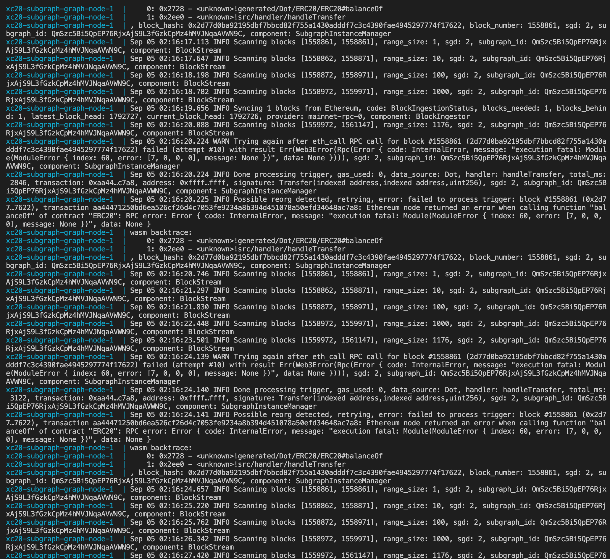

# Astar XC-DOT Subgraphs

## Get Started

Build subgraph
```bash
yarn
yarn graph codegen
yarn graph build
```

Locally host Graph Node:
```
docker-compose up
```

Deploy subgraph to localhost Graph Node:
```
yarn create:local
yarn deploy:local
```

## Current Behavior
The subgraph start indexing from block `50000`. It should be able to index smoothly. After `1558861`, indexing starts failing. 

Here is how the error should looks like:

